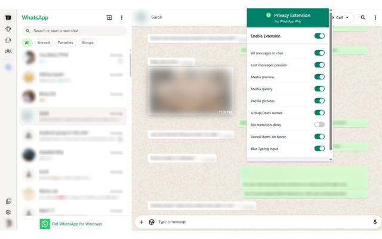

# WhatsApp Privacy Extension 🛡️

> **Privacy on your terms.** The essential Chrome extension for WhatsApp Web that blurs your messages, media, and contacts automatically. Reveal them instantly with a simple hover.

---

## ✨ Features

- **🔒 Blur Messages:** Conversation text stays hidden until you hover. No accidental reveals in open offices or public spaces.
- **🖼️ Hide Media:** Photos and videos are blurred automatically. You decide when it's safe to view them.
- **👥 Anonymous Contacts:** Blur contact names and profile pictures to keep your social network private.
- **⚡ Instant Toggle:** Use a global switch or keyboard shortcuts to flip privacy on or off in a heartbeat.
- **✍️ Typing Privacy:** Blurs your input area so nobody can read what you're drafting.
- **🚀 Lightweight:** Zero performance hit. WhatsApp Web runs exactly as fast as before.

## 🛡️ Privacy First

This extension is built with a **security-first** mindset:
- **Zero Data Collection:** No analytics, no telemetry. Nothing ever leaves your browser.
- **Minimal Permissions:** Only requests access to `web.whatsapp.com`.
- **Fully Open Source:** Every line of code is transparent and open for audit.

## 🚀 Getting Started in 60 Seconds

1. **Install:** [Add to Chrome](https://chromewebstore.google.com/detail/whatsapp-privacy-extensio/jbipjgbbfhdgedlpgpngpjoafpncjgdf) from the Web Store.
2. **Open WhatsApp:** Navigate to [web.whatsapp.com](https://web.whatsapp.com).
3. **Configure:** Click the extension icon to choose what you want to blur.
4. **Enjoy Privacy:** Simply hover over any blurred element to reveal it instantly.

## 🛠️ Built by a Maker

Made with ❤️ by **Ali Sufian**. I build tools that I actually need, and I hope this helps you too!

- 💻 **GitHub:** [@alisufiankhan](https://github.com/alisufiankhan)
- 📸 **Instagram:** [@alis.code](https://instagram.com/alis.code)
- 📧 **Email:** [alisufiancodes@gmail.com](mailto:alisufiancodes@gmail.com)

---

## 📄 License

This project is licensed under the MIT License - see the [LICENSE](LICENSE) file for details.
